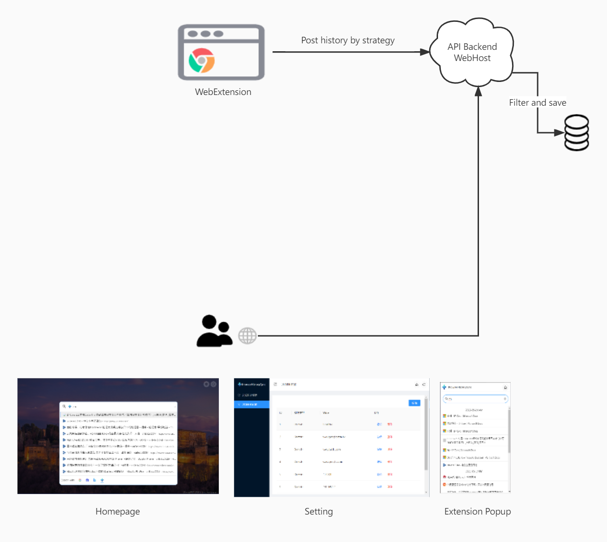
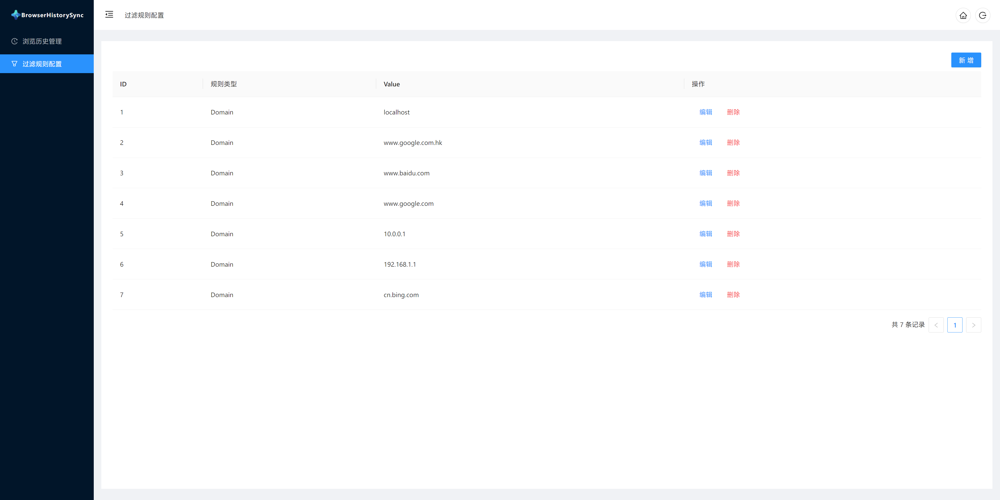
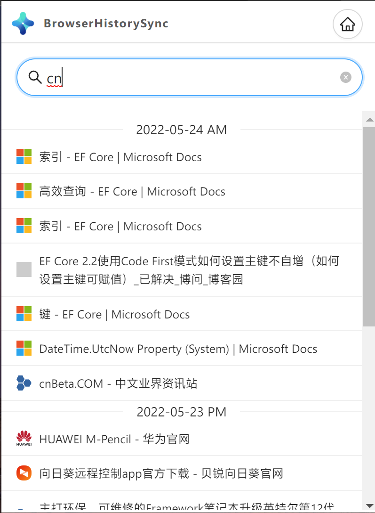

# BrowserHistorySync

## 介绍

浏览器历史访问记录同步介绍：
因为个人的习惯，每天都会通过浏览器访问各种各样的网站、查看一些技术文档、论坛文章、各类信息等等；遇到自己喜欢的文章或者感觉有用的信息网站，自己会想办法保存下来，使用过 Pocket、印象笔记甚至浏览器自带的收藏夹，但是随着时间的推移，会发现这些软件中存了一堆未整理过的或者说是后续几年都没继续访问过的记录； 更有时候在遇到问题的时候，会突然想到几个月前在某个网站看到过解决该问题的思路，只是当时没有把该网站记录下来，再去寻找当时的网站时，会浪费掉大量时间通过搜索引擎重新寻找。所以只需要一个轻量级的服务，可以记录个人历史访问的地方，自动把历史访问记录保存下来，供后续使用。
主流浏览器自带历史记录同步功能，但现在主要有以下问题不满足需求

1. 什么时候记录？ 页面打开？ 临时的 302 跳转 url 会不会记录，这块到现在我还是比较迷惑；
2. 同步效果， edge chrome 重度用户，但是国内的同步效果真的挺惨淡；
3. 作为搜索引擎的重度用户，历史访问记录里面一大半被谷 x，bing 充斥着；这些历史记录没有任何意义；

基于以上问题，自己写了个服务，配合 Web Extension 插件，实现了对个人浏览历史记录的自动保存、过滤、搜索功能；

## High-level Architecture

### Webextension

`用于监听浏览器新Tab页打开、URL变化； 根据预设定的策略上报浏览器访问历史；`

预设基于时间计时器的上报策略，等页面 URL 稳定保持不变一定时间后再上报历史访问记录； 防止上报一些 302 登录的临时 url，以及一些看一眼就关闭的页面。

### API Backend & WebHost

`存储管理后台；`

1. 支持设置 filter 过滤保存历史记录；Filter 支持 subdomain；keywords；domain 等匹配方式；
2. 支持存储历史记录到 Mysql、Sqlite、Postgresql、MariaDB 数据库；
3. 设置系统 Password，通过 Cookie 记录登录信息；

### 前端 Web 入口

#### Homepage 页面

1. 集成 Bing 壁纸，每天一个高清壁纸；
2. 集成了谷歌搜索、百度搜索、bing 搜索的搜索建议以及搜索入口；
3. 支持根据关键字搜索历史访问记录；

#### Setting 页面

1. 支持历史访问记录的管理；
2. 支持过滤规则设置管理；

#### Web Extension Popup

## 项目介绍

### SyncManagerApi

Net6 C# WebAPI & WebHost;

[Docker 镜像](https://hub.docker.com/repository/docker/xckai123/browser-history-sync)

运行环境变量设置：

- DBType: 数据库类型
  1. Mysql
  2. Postgresql
  3. Sqlite
  4. Mariadb
- DBConnectionStr： 对应的数据库连接字符串；
- AuthSecret: 系统密码，该项目是单租户、单用户项目；浏览记录属于隐私，请设置相对复杂系统密码；

### Web

React Antd SPA 项目前端项目；编译后的前端资源会自动放置到 SyncManagerApi 项目下的 wwwroot 文件夹中；

- 包管理器推荐 Pnpm;
- 包管理器推荐 Pnpm;
- 安装依赖包： pnpm i
- 运行开发环境：pnpm start
- 编译：pnpm run build

### WebExtension

Web 插件项目；

- 包管理器推荐 Pnpm;
- 包管理器推荐 Pnpm;
- 安装依赖包： pnpm i
- 运行开发环境：pnpm start
- 编译：pnpm run build

## 怎么使用
[Docker 镜像](https://hub.docker.com/repository/docker/xckai123/browser-history-sync)

docker run  -p 9909:80 -e DBType="sqlite" -e DBConnectionStr="Data Source=Application.db;Cache=Shared" -e AuthSecret="123"  xckai123/browser-history-sync

Chrome 扩展： 申请中；

Edge 扩展：申请中；

[Firefor扩展](https://addons.mozilla.org/zh-CN/firefox/addon/browserhistorysync/?utm_source=addons.mozilla.org&utm_medium=referral&utm_content=search)